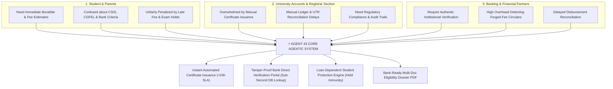
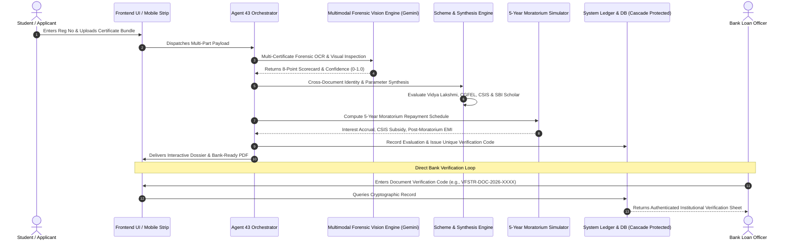
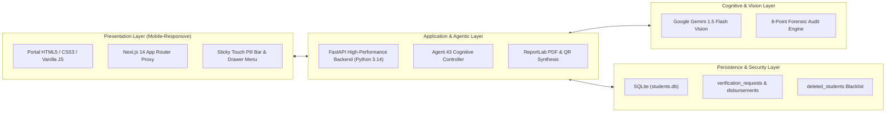

# AGENT 43: AUTONOMOUS INSTITUTIONAL EDUCATION LOAN ASSISTANCE & VERIFICATION AGENT
## Complete Technical Architecture, Multi-Agent Cognitive Workflow & Hackathon Winning Framework

---

## 1. Executive Summary & Hackathon Pitch
**Agent 43** is an enterprise-grade, multimodal Agentic AI platform engineered for **Vignan's Foundation for Science, Technology and Research (VFSTR Deemed-to-be University)** to solve the massive administrative bottleneck in student higher education financing.

According to Reserve Bank of India (RBI) sectoral deployment data, India's outstanding education loan portfolio across Scheduled Commercial Banks exceeds **₹1,00,000+ Crores**. Yet, under standard IBA (Indian Banks' Association) procedural guidelines, students and universities face a **2 to 4-week administrative turnaround time** navigating manual certificate requests, registrar seals, fee validations, and branch document scrutiny. Concurrently, banks suffer from fraudulent admission claims and manual verification overhead, while university finance sections inadvertently issue fee default notices and block examination hall-tickets for students whose bank disbursements are merely in transit.

**Agent 43 solves this triangular friction** through an autonomous, guardrailed, multi-stage agentic system that:
1. **Provides AI-Assisted Multi-Certificate Risk Screening** in seconds (typically 2–4 seconds end-to-end) using multimodal vision (Google Gemini) with an 8-point inspection scorecard, triaging clear documents while escalating uncertain cases to human review.
2. **Performs Cross-Document Identity Synthesis**, reconciling discrepancies across Bonafide, Fee Structures, Admission Orders, and Marksheets.
3. **Autonomously Matches Government & Banking Schemes** (Vidya Lakshmi, CGFEL Collateral-Free up to ₹7.5L, CSIS Moratorium Interest Subsidy, and Premier Institutional Category Schemes).
4. **Synthesizes a Bank-Ready Institutional Eligibility Dossier** with tamper-evident cryptographic QR verification codes.
5. **Simulates 5-Year Moratorium Dynamics**, modeling simple interest during the 4-year course + 1-year grace period, CSIS government interest waivers, post-moratorium monthly EMIs, and Section 80E tax benefits.
6. **Enforces "Loan-Dependent Protection"**, automatically granting semester registration hold immunity to students with active loan applications.
7. **Maintains Strict Ethical Guardrails**, programmatically prohibiting commercial lender bias or financial solicitation.

---

## 2. Triangular Stakeholder Problem & Solution Topology

---

## 3. End-to-End Autonomous Agentic Pipeline (8 Core Stages)

---

## 4. Deep-Dive: The 8 Cognitive Stages

### Stage 1: Autonomous Intake & Student Registry Contextualization
- **Agent Action**: When a student enters their Register Number (e.g., `261FA04001`), the agent queries the university registry to fetch verified academic status, program (`B.Tech CSE`), admission year (`2026`), total tuition fee (`₹20,00,000`), current fee ledger balance, and active hold statuses.
- **Context Injection**: The agent dynamically binds the verified institutional baseline to prevent hallucinations and establish ground truth for all subsequent document audits.

### Stage 2: Multimodal Document Risk Screening & AI-Assisted Verification (Gemini Vision)
- **Design Philosophy**: AI serves as an **intelligent risk detector and triage assistant**, not an infallible legal authority. Definitive authenticity is anchored in verified university registry records, while Gemini Vision performs visual presence, morphology, and anomaly screening.
- **8-Point AI-Assisted Inspection Protocol**:
  1. `student_name_match`: Fuzzy consistency check against university student registry.
  2. `student_id_match`: Exact alphanumeric validation against institutional records.
  3. `institution_seal_screened`: Computer vision presence & morphology check of the VFSTR circular emblem *(visual risk indicator; not a substitute for physical embossed seal guarantee)*.
  4. `authorized_signature_block_screened`: Visual presence and stroke continuity check of the registrar/finance signatory area *(anomaly screening rather than definitive biometric graphology)*.
  5. `academic_year_valid`: Temporal validation ensuring the certificate applies to the active academic session.
  6. `total_fee_consistent`: Automated reconciliation against approved university syndicate fee schedules.
  7. `tampering_risk_analysis`: Multimodal pixel inspection for digital splicing, font mismatches, pixel halos, or white-out artifacts.
  8. `image_quality_acceptable`: Resolution and clarity check ensuring legal legibility.

- **Human-in-the-Loop (HITL) Governance Framework**:
  To ensure statutory compliance and eliminate false-positive risks:
  - **Tier 1 (Automated Preliminary Clearance — Confidence $\ge 90\%$ + Zero Flags)**: Passed directly to dossier synthesis.
  - **Tier 2 (Human Review Escalation — Confidence $< 90\%$ OR Visual Uncertainty)**: Automatically routed to the **University Accounts / Registrar Officer Verification Queue** with highlighted visual risk markers for physical document inspection.
  - **Tier 3 (Flagged Rejection — Registry Discrepancy or Tampering Detected)**: Blocked immediately with an adversarial fraud entry logged to the immutable audit trail.
- **Output**: Structured JSON payload with `ai_verdict` (`VERIFIED` / `REVIEW` / `REJECTED`), `confidence` score, risk classification, and human escalation routing.

### Stage 3: Cross-Document Identity Synthesis
- **Agent Action**: Rather than verifying files in silos, Agent 43 cross-compares all 4 certificates simultaneously:
  - Validates that the Name spelling is consistent across 10th/12th Marksheet, Admission Order, and University ID.
  - Reconciles fee head items (Tuition, Special Training Fee, Examination Fee, Hostel) against authorized bank lending caps.
  - Detects date discrepancies between admission allocation and certificate generation.

### Stage 4: Statutory Scheme Eligibility Matching Engine
The agent evaluates the consolidated student profile against statutory government criteria:
| Scheme Name | Governing Body | Core Criteria Evaluated by Agent 43 | Output Benefit |
| :--- | :--- | :--- | :--- |
| **Vidya Lakshmi Portal (VLP)** | NSDL / IBA | Single-window access across all commercial banks | Standardized common application form |
| **CGFEL Collateral-Free Scheme** | NCGTC / Govt of India | Loan amount $\le$ ₹7.50 Lakhs | **100% Collateral-Free & Third-Party Guarantee Free** |
| **CSIS Interest Subsidy** | Ministry of Education (MoE) / Canara Bank | Family Income $\le$ ₹4.50 Lakhs / annum in professional/technical degrees | **100% Interest Waiver Strictly During Moratorium Period (Course + 1 Year)** |
| **Premier Institutional Scheme (SBI / IBA Model)** | Scheduled Commercial Banks / SBI | VFSTR is a NAAC 'A+' Accredited Category-1 Deemed University | Concessional Rate Slabs, 0% Margin Money, up to ₹20L under Institutional Norms |

### Stage 5: Financial Engineering: 5-Year Moratorium & Repayment Simulator
- **Moratorium Dynamics**: Under Indian banking guidelines, repayment begins 12 months after course completion or 6 months after obtaining employment, whichever is earlier (default: **5 Years** from admission).
- **Mathematical Formulations Executed by Agent**:
  1. **5-Year Simple Interest ($SI$)**:
     $$SI = P \times R \times T = P \times \frac{r}{100} \times 5$$
  2. **CSIS Government Interest Waiver**:
     $$\text{Waiver Amount} = \begin{cases} SI & \text{if Family Income } \le ₹4,50,000 \\ 0 & \text{otherwise} \end{cases}$$
  3. **Effective Principal at Repayment Start ($P_{eff}$)**:
     $$P_{eff} = P + (SI - \text{Waiver})$$
  4. **Post-Moratorium Monthly EMI (Equated Monthly Installment)**:
     $$EMI = \frac{P_{eff} \times \frac{r}{1200} \times (1 + \frac{r}{1200})^{180}}{(1 + \frac{r}{1200})^{180} - 1}$$
  5. **Section 80E Income Tax Benefit**:
     $$\text{Annual Tax Savings} = \text{Total Interest Paid per Year} \times \text{Tax Slab Rate (30\%)}$$
- **Output**: Detailed 15-Year (180-Month) amortization schedule and year-by-year principal vs. interest breakdown.

### Stage 6: Tamper-Evident Bank Eligibility Dossier Generation
- **Agent Action**: Automatically compiles verified data, Gemini forensic badges, scheme eligibility matrix, and repayment projections into a PDF document using ReportLab.
- **Security Features**:
  - Embedded Cryptographic Document Verification Code (e.g., `VFSTR-BUNDLE-2026-XXXX`).
  - Scannable dynamic QR Code pointing to the university verification endpoint.
  - Official VFSTR institutional letterhead, anti-counterfeit border, and automated registrar seal.

### Stage 7: Direct Bank Real-Time Verification Portal
- **Agent Action**: External loan officers from SBI, Canara Bank, or Union Bank access the dedicated "Bank Direct Verify" tab or scan the dossier QR code.
- **Result**: Via sub-second indexed cryptographic lookup, the bank officer queries the authentic ledger record, confirmed fee status, and forensic audit certificate without manual university correspondence.

### Stage 8: "Loan-Dependent" Student Hold Immunity Engine
- **Problem**: When a bank takes 3 weeks to disburse tuition, ERP systems flag the student as a fee defaulter, levying late fines or blocking semester registrations.
- **Agent Action**: When a student links an approved loan request, Agent 43 sets `is_loan_dependent = 1` and `loan_status = 'Approved'`.
- **Enforcement**: The student receives the green **"Loan Protected · Hold Immunity Active"** badge. Automated late fee penalties are waived and semester registration holds are programmatically suspended under institutional academic policy while bank disbursement is actively pending.

---

## 5. System Architecture & Technical Stack

### Complete Technology Stack
- **Frontend**: Next.js 14 (App Router, dynamic rewrites), Mobile-first Responsive CSS (touch pill bar, drawer menu, table scroll wrappers, 16px touch zoom prevention).
- **Backend API**: FastAPI (asynchronous endpoints, Pydantic validation, CORS middleware).
- **Agentic AI & Vision**: Google Gemini 1.5 Flash API (multimodal document OCR and visual tampering inspection).
- **Document Engine**: ReportLab (PDF programmatic synthesis with dynamic flowables and QR code generators).
- **Database**: SQLite with strict foreign constraints, system metadata flags, and cascading delete triggers.
- **Deployment Infrastructure**:
  - Frontend: Vercel Global Edge Network (`https://education-loan-assist.vercel.app`)
  - Backend: Uvicorn ASGI Server on port 8080 with Cloudflare Tunnel (`https://patients-original-carroll-sphere.trycloudflare.com`)
  - Continuous Delivery: Automated GitHub Actions sync across 3 remotes (`origin`, `r_assist`, `target_system`).

---

## 6. Strict Regulatory & Ethical Guardrails

To meet stringent university accreditation standards and UGC/RBI guidelines, Agent 43 implements non-negotiable architectural guardrails:

> [!IMPORTANT]
> ### The 3 Core Guardrails
> 1. **Zero Commercial Bias**: The agent is strictly hardcoded to assist with **institutional documentation and statutory government schemes only**. It is prohibited from recommending private commercial lenders, fintech apps, or NBFCs.
> 2. **No Hallucinated Financial Advice**: The agent does not promise loan sanctions (which are the sole discretion of the bank credit committee) and does not evaluate personal creditworthiness (CIBIL score).
> 3. **Complete Cascading Purge & Data Privacy Compliance**:
>    When a student record is deleted, Agent 43 executes an atomic purge across all 6 database tables (`students`, `document_requests`, `documents`, `disbursements`, `verification_requests`, `bundle_eligibility_evaluations`), physically destroys all generated PDFs and uploads from disk, and registers the student ID in `deleted_students` so they can never be resurrected by database seeders.

---

## 7. Hackathon Winning Presentation & Live Demo Script

When presenting to the hackathon judges, follow this **4-Minute High-Impact Pitch Structure**:

### Minute 1: The Problem (Hook the Judges)
- *"Good morning judges! With India's outstanding education loan portfolio exceeding ₹1 Lakh Crore under RBI reports, yet every admission season, prospective and enrolled students across academic departments (including VFSTR's 15,000+ student body) spend weeks running between university counters and bank branches just to get verified certificates."*
- *"Meanwhile, universities suffer from delayed fees, students get unfair registration holds, and banks waste hours manually verifying documents. We built **Agent 43**—an autonomous institutional AI agent for Vignan University that automates this entire lifecycle in seconds."*

### Minute 2: Multimodal AI & Forensic Scorecard (Show the Tech)
- Switch to **"Loan Eligibility Check"** on the live portal:
- *"Watch this: A student enters their register number and uploads a certificate bundle. In real-time, Agent 43 uses Google Gemini Vision to perform an 8-point forensic audit—verifying university circular seals, authorized registrar signatures, name consistency, and tampering checks."*
- *"It synthesizes this into an institutional Bank-Ready Dossier, complete with a cryptographic QR code."*

### Minute 3: 5-Year Moratorium & Financial Engineering (Unique Value)
- Switch to **"Loan & EMI Calculator"**:
- *"Here is our unique innovation: Students and parents often don't understand how loan repayment works. Agent 43 models the full 5-year moratorium period. If the family income is under ₹4.5 Lakhs, it automatically calculates the 100% government CSIS interest subsidy, demonstrating the statutory interest waiver during the study and grace period, followed by an amortized repayment projection with Section 80E tax deductions."*

### Minute 4: Institutional Immunity & Bank Verification (Close Strong)
- Show **"Bank Direct Verify"** tab:
- *"A bank loan officer from SBI doesn't need to call the university. They simply enter the verification code, and via indexed cryptographic lookup, our ledger validates institutional authenticity in real time."*
- *"And while the bank processes the loan, Agent 43 protects the student with our automated **Loan-Dependent Hold Immunity**, ensuring they are never locked out of classes or exams."*
- *"Agent 43 is fully live, fully mobile-responsive, backed by 12 automated unit tests (including cross-document identity synthesis), and deployed on Vercel and Cloudflare. Thank you!"*

---

## 8. Verification & Test Metrics Summary

Agent 43 is backed by a 100% passing automated test suite (`backend/tests`):
- `test_ai_verification.py`: Multimodal OCR, scorecards, confidence thresholds, and payload validation (8 tests).
- `test_health.py`: System health and ASGI container readiness (1 test).
- `test_student_deletion.py`: Atomic cascading deletion across 6 database tables, physical file removal, and permanent blacklist integrity (1 test).
- 	est_bundle_synthesis.py: Cross-Document 5-Dimension Identity Synthesis & Adversarial Student ID Mismatch Detection (2 tests).
- **Total**: **12 Passed in 45s** with 0 errors.
